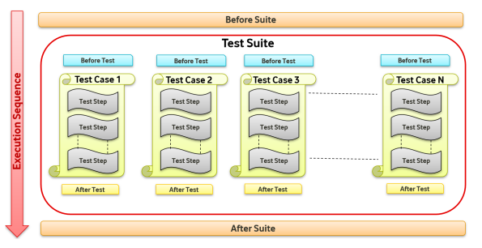

[Back](/README.md)

# Testing with Framework

This section discusses how to get started with configuring Tests.

## Basic Entities

Below are the basic entities:

   - **TestSuite** - Each Test Suite contains below entities:

     - **BeforeSuite** : If present, will be executed 1st as soon as Test Suite execution starts
     - **BeforeTest** : If present, will be executed 2nd in sequence
     - **Test** : Mandatory should be present for test execution
     - **AfterTest** : If present, will be executed after test execution
     - **AfterSuite** : If present, will be executed at last after executing all tests

Note: BeforeTest & AfterTest are executed with each Test, but beforeSuite & afterSuite are executed only once per TestSuite

## Flow of Events

Below is flow of execution



## Configuring Test

All variable created by framework or in ConfigMaps can be referenced by
enclosing variable name within parenthesis ‘{}’ eg: ‘{variable_1}’

All variable references should be enclosed within single quotes (‘) or double quotes (“)

Method invocation shouldn’t be enclosed in single or double quotes eg: method:.. (Arguments)

- Follow below steps:

- Create a Directory insider Resources/Test/ with name of TestSuite
- Create beforeSuite file (if required) with pattern as defined in configMaps eg:beforeSuite_<anyname>.yaml
    - Variables declared in beforeSuite will be available throughout the Tests and these will be initialized first thing in the current TestSuite

````
    declare:
     variable: '<Variable Value or Any Variable from configMap>'
     variable_1: '{UsersStrategy.vfkdOperator.admin_password}'
     variable_2: method:<packageName>.<ClassName>.<StaticMethodName>(<Argument_Value>)
     ..
 
    beforeSuiteActions:
     - <Step1>
     - <Step2>
     - <Step3>
````

- Create beforeTest file (if required) with pattern as defined in configMaps 
    eg:
        beforeTest_<anyname>.yaml
    Here there is no declare section

````
    beforeSuiteActions:
     - <Step1>
     - <Step2>
     - <Step3>
     - ..
     - ..
````

- Create Test Case file (atleast 1) with pattern as defined in configMaps 
    eg:
        test_<anyname>.yaml
- beforeTest & afterTest path should be relative to current path of the test yaml
- Below are Optional (If required can be added to test yaml):
    - declare
    - beforeTest (If this test needs any steps to be executed in beforeTest)
    - afterTest (If this test needs any steps to be executed in afterTest)
- Below are mandatory fields:
    - testCaseName
    - testCaseDescription
    - steps with at least 1 Step
  
````
    testCaseName: '<Test Case name to be displayed in reports>'
    testCaseDescription: '<Test description to be displayed in HTML report>
    declare:
     <variable1>: '<Variable Value or Any Variable from configMap
     variable_1: '{UsersStrategy.vfkdOperator.admin_password}'
     variable_2: method:<packageName>.<ClassName>.<StaticMethodName>(<Argument>)
     ..
     ..
     ..
    beforeTest: '\BeforeTest\beforeTest_generate_jwt_token.yaml' #Path of beforeTest
    afterTest: '\AfterTest\afterTest_domain_delete.yaml' #Path of afterTest 
    steps:
     - <Step1>
     - <Step2>
     - <Step3>
     - ..
     - ..
````

- Create afterTest file (if required) with pattern as defined in configMaps 
    eg:
        afterTest_<anyname>.yaml

  Here there is no declare section

````
    beforeSuiteActions:
     - <Step1>
     - <Step2>
     - <Step3>
````

- Create afterSuite file (if required) with pattern as defined in configMaps 
    eg:
        afterSuite_<anyname>.yaml

  Here there is no declare section

````
    beforeSuiteActions:
    - <Step1>
    - <Step2>
    - <Step3>
    - ..
    - ..
````

## Test Step

TestStep is building block for the framework. All actions within framework are done
via these steps. In terms of Backend Automation each step acts as individual API call

TestStep template
````
    description: "<Step Description>"
    url: "${httpClient}/apiPath/apiPath"
    method: REST.POST   
    ignoreHook: true  
    retry: 2
    foreach: '{<variable of type ArrayList>}'
    request:
         headers:
         Content-Type: application/json
         Auth: "{token}"
     operationId: "<swagger-spec-operationId>"
     data:
         $.ks: "{adminks}"
         $.device.activatedOn: null
         $.device.brandId: "{dBrandId}"
         $.device.deviceFamilyId: null
         $.device.drm: '{variable[?]}'
         $.device.householdId: method:<packageName>.<ClassName>.<StaticMethod>
         $.device.name: "TestDevice"
         $.device.status: null
         $.device.udid: "{dUdid}"
    response: # Actions to be perfromed on response received
         code: 200 # Validate HTTP code retruned from server. 
         validate: # Validations
         fields: # field level validation
            $.result.status: "ACTIVATED" 
            $.result: "{variable}" 
            methods: # Validation methods with Assertions
    schema: # Response schema validation against swagger schema
       strict: false
    save: # Save variables by jsonpath or method call
        var[?]: $.result 
        deviceUdid: $.result.udid
        udid: <packageName>.<ClassName>.<StaticMethodName>(<Arguement1>)
````

Above step can be configured with required data & added in BeforeSuite, BeforeTest,
Test, AfterTest & AfterSuite yaml files.

## Standalone Test Step

These are TestStep but without any request, url, plugin identified. It contains only
Validation & Save section

Template:
````
    description: "<Step Description>"
    response:
    validate:
    methods:
    - <packageName>.<ClassName>.<StaticMethodName>(<Arguement1>)
    - <packageName>.<ClassName>.<StaticMethodName>(<Arguement1>)
    save:
      assetId: <packageName>.<ClassName>.<StaticMethodName>(<Arguement1>)
````

If $ passed to any of the methods, then response from previous step is passed to
method. In case this is the 1st step of test then null