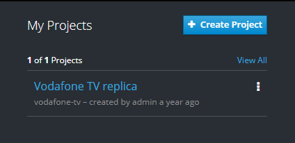
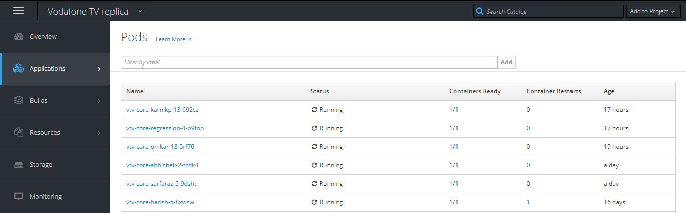
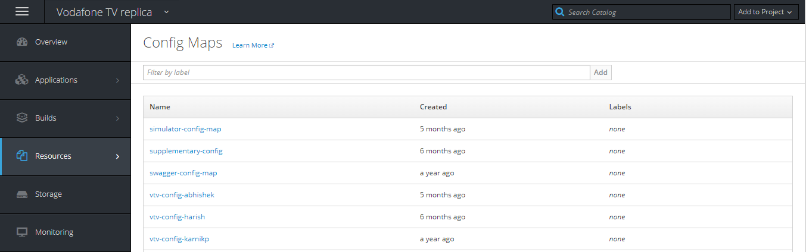
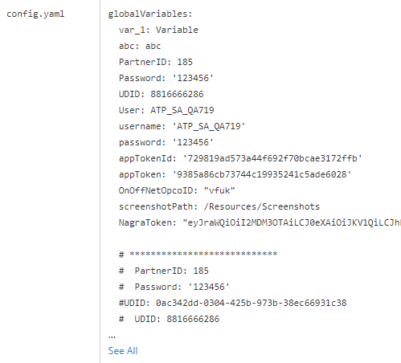
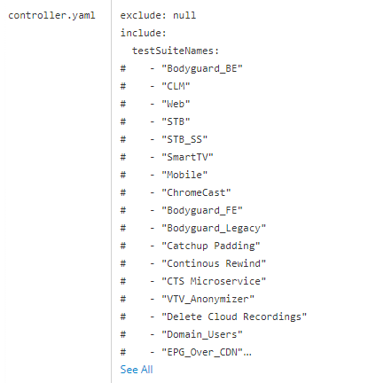
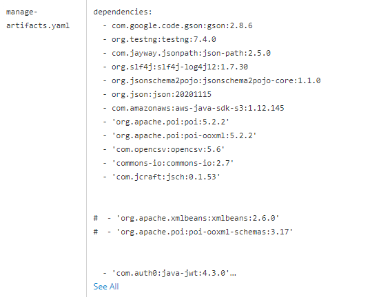
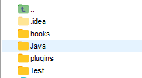

[Back](/README.md)

# Setup

  This section discusses how to get started with InVent. It deals with the usage and set up of the
framework, so you are ready to start writing test cases after reading this section.

## Using Framework Platform
- Pre-requisite:

    - Remote server access (connection details & private key)

- Follow below steps:

    - Create Tunnel via MobaXterm (Tools –> MobaSSHTunnel) with below details:
        - Remote server 192.168.0.14:8443
        - Local Client port 8443
        - SSH Server details <HostIp> 22 <user>
    - Upload private key & select auto-reconnect
    - Start SSH Tunnel
    - Navigate to http://:/login
    - Enter user credentials & click on login
    - Click on vodafone_tv project under My Projects
  

- Navigate to Applications –> Pods to view all available running Pod

- Navigate to Resources –> Config Maps to view all available configurations

## Framework Configurations

Framework configuration is done in the Config Maps of the respective Pods. Here we define
important configuration parameters which defines the framework functioning.

- Sample Config

    - Configurations are defined in config.yaml file of configMap

- Sample Controller Config
  
    - User can control the testSuites to be executed by Framework by updating the TestSuites in controller.yaml configuration file

- Sample External Dependencies
    
    - User can add external dependencies for External Java Code by updating gradle(short) dependencies manage-artifacts.yaml

## Directory Setup

Below directory setup needs to be adhered within individual work area at
    
    /abhishek/Resources/:

    hooks : Directory will contain hook related jars
    Java : Directory will contain all test realted Java Code
    plugins : Directory will contain plugin related jars
    Test : Directory will contain Test Suites