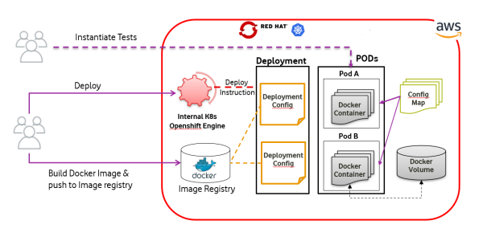

[Back](/README.md)

# Introduction
Enterprise applications usually interacts with different backends over various messaging interfaces.
In Backend test scenario we need to simulate the communication between backends over various transports.

   - How can we test use case scenarios that include several interface partners interacting with each other?
   - How can somebody ensure that the software components work correctly for E2E behaviour?
   - How can somebody run backend test cases in an automated E2E way?

   InVent tries to answer these questions!

## Overview

InVent aims to strongly support Backend Automation with E2E approach across different messaging transports. 
Easily send & receive messages with Plugin Based Architecture for supporting various protocols.
   
Test cases describe a whole use case scenario including several interfaces/protocols/systems that exchange many messages with each other. 
The composition of complex message flows in a single test case to serve End-To-End journey with collection of test steps is one of the major highlights of the framework.
   
The test case scripting is done in YAML and can be executed as automated tests. With easy definition of API calls, Swagger Integration & validations for expected message
content InVent is able to validate the incoming data towards syntax and semantics. 

## Framework Architecture

## Framework Platform

InVent Framework is accessed via **VTV BE Framework Platform** (Framework Platform)

Framework Platform helps in running Containerized instances of InVent on
Redhat/Kubernetes pods within AWS machine.

Current Platform architecture is as below:

